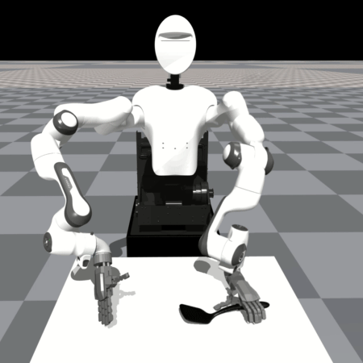
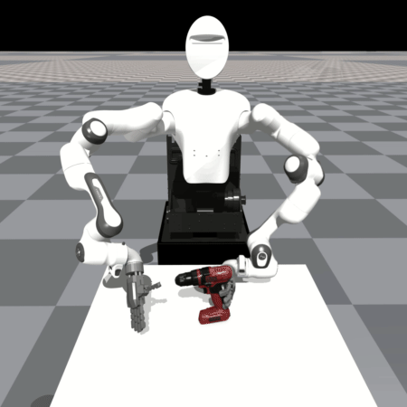
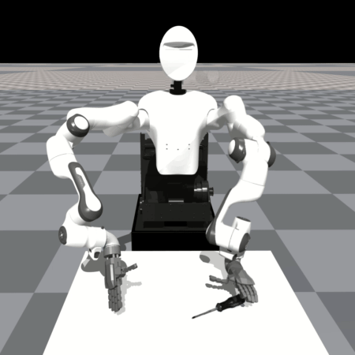
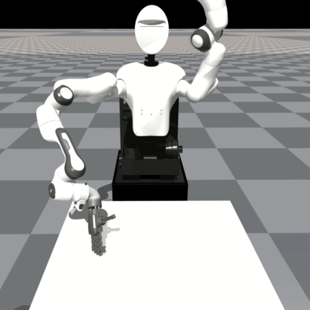
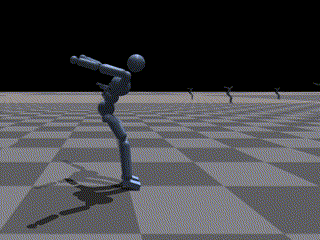
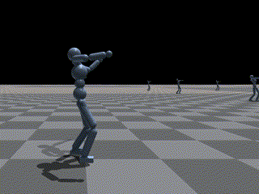
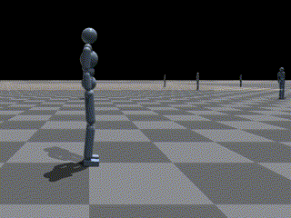
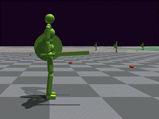
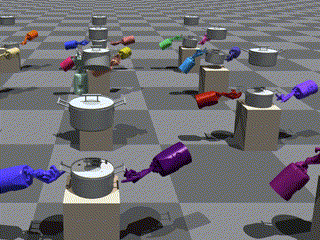
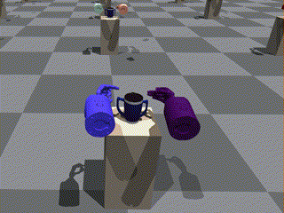

Rofunc v0.0.2.6 is released with plenty of robots skill learning examples! :sparkles: :rocket:

---

# Rofunc: The Full Process Python Package for Robot Learning from Demonstration and Robot Manipulation

> **Repository address: https://github.com/Skylark0924/Rofunc**  
> **Documentation: https://rofunc.readthedocs.io/**

