## 数据结构

#### 二叉树

前序遍历：根结点 ---> 左子树 ---> 右子树

中序遍历：左子树---> 根结点 ---> 右子树

后序遍历：左子树 ---> 右子树 ---> 根结点

层次遍历：只需按层次遍历即可

**例一**

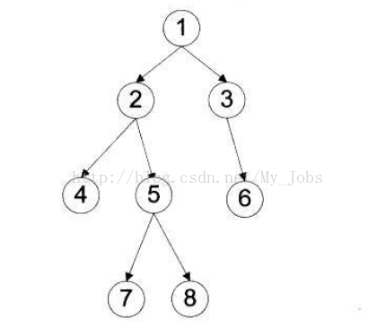

前序遍历：1  2  4  5  7  8  3  6 

中序遍历：4  2  7  5  8  1  3  6

后序遍历：4  7  8  5  2  6  3  1

层次遍历：1  2  3  4  5  6  7  8

**例二**

先序：1 2 4 6 7 8 3 5
中序：4 7 6 8 2 1 3 5
后序：7 8 6 4 2 5 3 1

**三种遍历方法的考查顺序一致，得到的结果却不一样，原因在于：**

**先序：**考察到一个节点后，即刻输出该节点的值，并继续遍历其左右子树。(根左右)

**中序：**考察到一个节点后，将其暂存，遍历完左子树后，再输出该节点的值，然后遍历右子树。(左根右)

**后序：**考察到一个节点后，将其暂存，遍历完左右子树后，再输出该节点的值。(左右根)

#### 图论

G=(V,E) V节点，E边

深度优先搜索DFS: **1.递归下去 2.回溯上来。顾名思义，深度优先，则是以深度为准则，先一条路走到底，直到达到目标。这里称之为递归下去。**

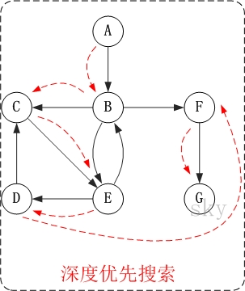

广度优先搜索BFS: **1.在面临一个路口时，把所有的岔路口都记下来 2.选择其中一个进入，然后将它的分路情况记录下来 3.然后再返回来进入另外一个岔路，并重复这样的操作.**

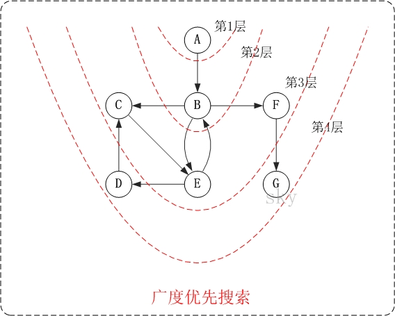

#### 堆

堆(优先队列)(先进先出FIFO)分为两种：**最大堆**和**最小堆**，在最大堆中，父节点的值比每一个子节点的值都要大，故最大值存放在树的根节点。在最小堆中，父节点的值比每一个子节点的值都要小，故最小值存放在树的根节点。除最大最小外其他节点顺序未知。

堆构建成二叉树后的序列: 初始序列为1 8 6 2 5 4 7 3一组数采用最小堆排序

### 算法

#### 排序

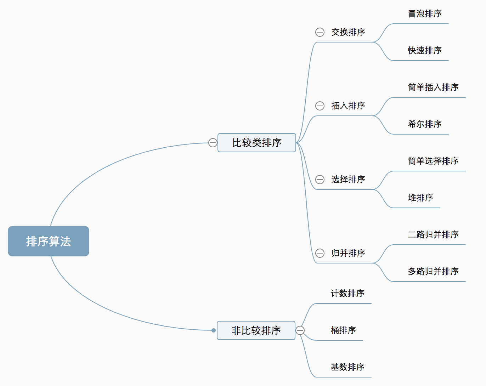

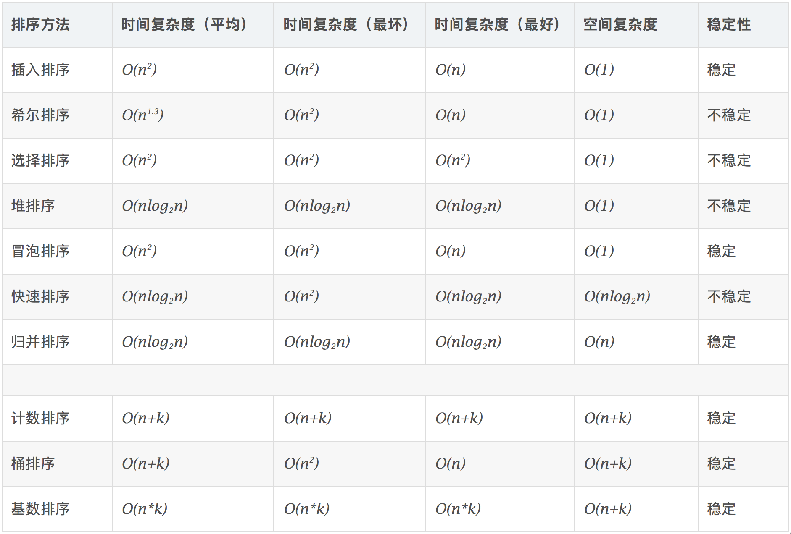

1. 冒泡排序：**一次比较两个元素，如果它们的顺序错误就把它们交换过来。**

   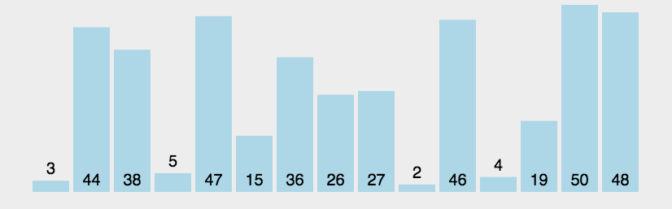

2. 选择排序：**首先在未排序序列中找到最小（大）元素，存放到排序序列的起始位置，然后，再从剩余未排序元素中继续寻找最小（大）元素，然后放到已排序序列的末尾。**!

   

3. 插入排序：**通过构建有序序列，对于未排序数据，在已排序序列中从后向前扫描，找到相应位置并插入。**

   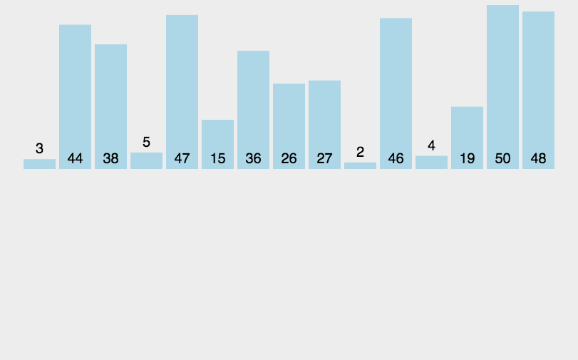

4. 希尔排序：**插入排序的改进版，它会优先比较距离较远的元素。**

   

5. 归并排序: **将已有序的子序列合并，得到完全有序的序列；即先使每个子序列有序，再使子序列段间有序。**

   

6. 快速排序: 

   - 从数列中挑出一个元素，称为 “基准”（pivot）；
   - 重新排序数列，所有元素比基准值小的摆放在基准前面，所有元素比基准值大的摆在基准的后面（相同的数可以到任一边）。在这个分区退出之后，该基准就处于数列的中间位置。这个称为分区（partition）操作；
   - 递归地（recursive）把小于基准值元素的子数列和大于基准值元素的子数列排序。

   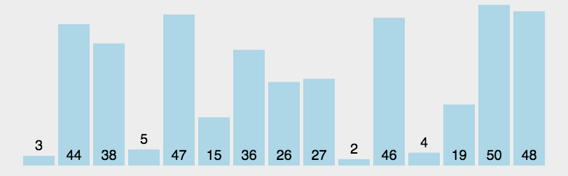

7. 堆排序：

   

8. 计算排序: 

   - 找出待排序的数组中最大和最小的元素；
   - 统计数组中每个值为i的元素出现的次数，存入数组C的第i项；
   - 对所有的计数累加（从C中的第一个元素开始，每一项和前一项相加）；
   - 反向填充目标数组：将每个元素i放在新数组的第C(i)项，每放一个元素就将C(i)减去1。

   

9. 桶排序: 

   - 设置一个定量的数组当作空桶；
   - 遍历输入数据，并且把数据一个一个放到对应的桶里去；
   - 对每个不是空的桶进行排序；
   - 从不是空的桶里把排好序的数据拼接起来。 

   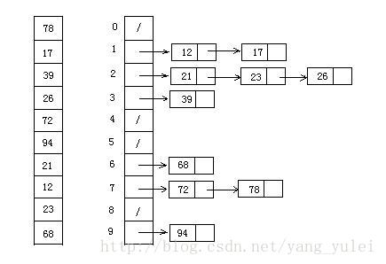

10. 基数排序: **低位先排序，然后收集；再按照高位排序，然后再收集；依次类推，直到最高位。**

    - 取得数组中的最大数，并取得位数；
    - arr为原始数组，从最低位开始取每个位组成radix数组；
    - 对radix进行计数排序（利用计数排序适用于小范围数的特点）；

    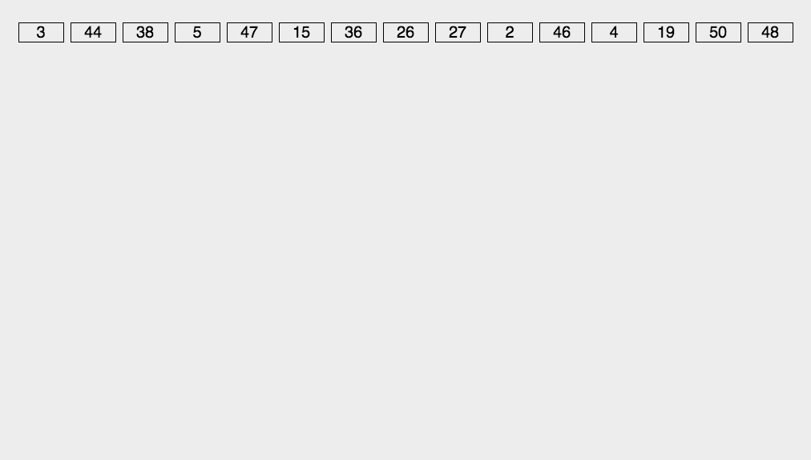

Reference: [十大经典排序算法（动图演示）](https://www.cnblogs.com/onepixel/p/7674659.html)

#### 最小二乘

y=kx
$$
(X^TX)k=X^TY\\
k=(X^TX)^{-1}X^TY
$$

## 矩阵

#### 特征值

不进行行列变换, $|\lambda E-A|$

#### 克莱姆法则

若线性方程组⑴的系数矩阵可逆（非奇异），即系数行列式 D≠0。有唯一解$X_0=A^{-1}\beta$

#### 线性方程组有解问题

1. 非齐次: 
   - 增广
   - 高斯消元行变换
   - 有效方程数 < 未知数个数 ($r(A)=r(A,b)<n$ 非满秩) -> 无穷多解
   - 含有无效方程 ($r(A)<r(A,b)$ A秩小于增广秩) -> 无解
   - 有效方程数 = 未知数个数 ($r(A)=r(A,b)=n$ 满秩) -> 唯一解
2. 齐次:
   - 无需增广做高斯消元
   - 有效方程数 < 未知数个数 ($detA==0$非满秩) -> 有非零解（多个解）
   - 有效方程数 = 未知数个数 ($detA≠0$满秩) -> 零解 (唯一解)

#### Jacobi/Hessian阵

Jacobi: $\mathbf{J}_{i j}=\frac{\partial f_{i}}{\partial x_{j}}$ 一阶导数阵
$$
\mathbf{J}=\left[\begin{array}{ccc}
\frac{\partial \mathbf{f}}{\partial x_{1}} & \cdots & \frac{\partial \mathbf{f}}{\partial x_{n}}
\end{array}\right]=\left[\begin{array}{ccc}
\frac{\partial f_{1}}{\partial x_{1}} & \cdots & \frac{\partial f_{1}}{\partial x_{n}} \\
\vdots & \ddots & \vdots \\
\frac{\partial f_{m}}{\partial x_{1}} & \cdots & \frac{\partial f_{m}}{\partial x_{n}} \\
\end{array}\right]
$$
Hessian: $\mathbf{H}_{i, j}=\frac{\partial^{2} f}{\partial x_{i} \partial x_{j}}$ 二阶倒数阵 $H^T=H$
$$
\mathbf{H}=\left[\begin{array}{cccc}
\frac{\partial^{2} f}{\partial x_{1}^{2}} & \frac{\partial^{2} f}{\partial x_{1} \partial x_{2}} & \cdots & \frac{\partial^{2} f}{\partial x_{1} \partial x_{n}} \\
\frac{\partial^{2} f}{\partial x_{2} \partial x_{1}} & \frac{\partial^{2} f}{\partial x_{2}^{2}} & \cdots & \frac{\partial^{2} f}{\partial x_{2} \partial x_{n}} \\
\vdots & \vdots & \ddots & \vdots \\
\frac{\partial^{2} f}{\partial x_{n} \partial x_{1}} & \frac{\partial^{2} f}{\partial x_{n} \partial x_{2}} & \cdots & \frac{\partial^{2} f}{\partial x_{n}^{2}}
\end{array}\right]
$$

1. 如果 $H(\bar{x})$ 是正定矩阵，则临界点 $\bar x$ 处是一个局部的极小值。
2. 如果 $H(\bar{x})$ 是负定矩阵，则临界点 $\bar x$ 处是一个局部的极大值。
3. 如果 $H(\bar{x})$ 是不定矩阵，则临界点 $\bar x$ 处不是极值。(鞍点)

#### 正定

堆非零向量 x, 

- $x^TAx>0$ 恒成立, A正定; 特征值均为正, A正定

- $x^TAx\ge 0$ 恒成立, A半正定; 特征值均$\ge 0$, A正定
- 特征值有正有负, 不定

## 微积分

#### 导数

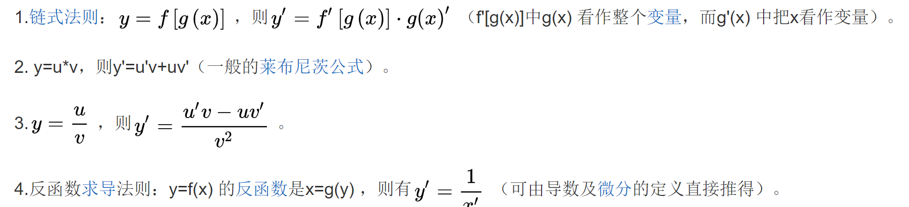

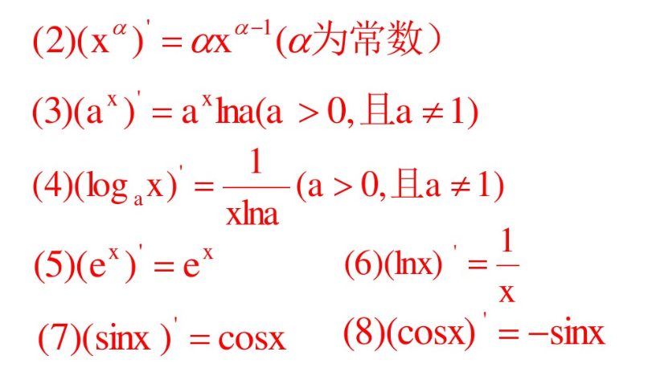

#### 积分

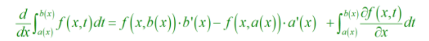

## 数理统计

#### 方差\协方差

标准差: $\sigma_X=\sqrt{\dfrac{\sum^n_{i=1}X_i}{n-1}}$

方差: $D(X)=\sigma^2_X={\dfrac{\sum^n_{i=1}X_i}{n-1}}$ n-1为了无偏估计, 以较小的样本集更好的逼近总体的标准差

协方差: $Cov(X,Y)=\dfrac{\sum^n_{i=1}(X_i-\bar{X})(Y_i-\bar{Y})}{n-1}$

- 你变大，同时我也变大，说明两个变量是同向变化的，这是协方差就是正的。
- 你变大，同时我变小，说明两个变量是反向变化的，这时协方差就是负的。
- 如果我是自然人，而你是太阳，那么两者没有相关关系，这时协方差是0。

相关系数: $\rho=\frac{Cov(X,Y)}{\sigma_X\sigma_Y}$

#### 点估计/区间估计

点: 用样本统计量来估计总体参数，因为样本统计量为数轴上某一点值，估计的结果也以一个点的数值表示，所以称为点估计。点估计虽然给出了未知参数的估计值，但是未给出估计值的可靠程度，即估计值偏离未知参数真实值的程度。

区间: 给定置信水平，根据估计值确定真实值可能出现的区间范围，该区间通常以估计值为中心，该区间则为置信区间。

#### 大数定律

取样数趋近无穷时，样品平均值按概率收敛于期望值。

##### 切比雪夫不等式: $P\{|X-\mu| \geq \varepsilon\} \leq \frac{\sigma^{2}}{\varepsilon^{2}}$ $P\{|X-\mu|<\varepsilon\} \geq 1-\frac{\sigma^{2}}{\varepsilon^{2}}$

**切比雪夫大数定律**: $X_{1}, X_{2} \ldots X_{n}$是相互独立的随机变量，且具有相同的期望μ，相同的方差σ2，那么$\frac{1}{n} \sum_{i=1}^{n} X_{i}->\mu$

**伯努利大数定律**: 设$f_n(A)$是n次独立重复试验中时间A发生的次数，p是事件A在每次试验中发生的概率，则对于任意正数$ε>0$.有 $\frac{f_{n}(A)}{n} \sim p$
$$
\lim _{n->+\infty} P\left\{\left|\frac{f_{A}}{n}-p<\right| \varepsilon\right\}=1
$$
**辛钦大数定律**: 设$X_{1}, X_{2} \ldots X_{n}$是相互独立且服从同一分布的随机变量序列，且具有数学期望$E(X_k)=μ，k=1,2,3…$。则对于$∀ε>0$，有
$$
\lim _{n->+\infty} P\left\{\left|\frac{1}{n} \sum_{k=1}^{n} X_{k}-\mu\right|<\varepsilon\right\}=1
$$
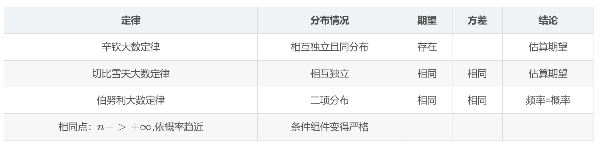

#### 中心极限定理

给定一个任意分布的总体。每次从这些总体中随机抽取 n 个抽样，一共抽 m 次。 然后把这 m 组抽样分别求出平均值。这些平均值的分布接近正态分布。

设随机变量$X_{1}, X_{2} \ldots X_{n}$相互独立且同分布，$E(Xi)=μ$，$D(Xi)=σ2，i=1,2,…$，则对于充分大的n，有 $\sum_{i=1}^{n} X_{i} \sim N\left(n \mu, n \sigma^{2}\right)$
$$
P\left(a<\sum_{i=1}^{n} X_{i}<b\right) \approx \phi\left(\frac{b-n \mu}{\sqrt{n} \sigma}\right)-\phi\left(\frac{a-n \mu}{\sqrt{n} \sigma}\right)
$$

#### 假设检验

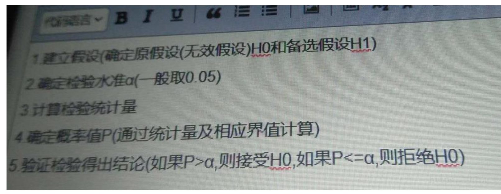

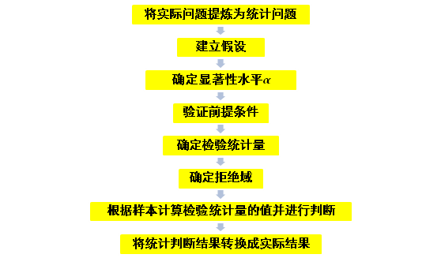

#### 置信区间

#### 秩统计量

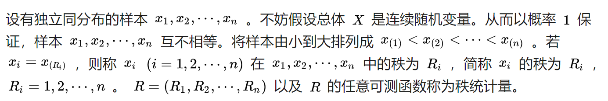

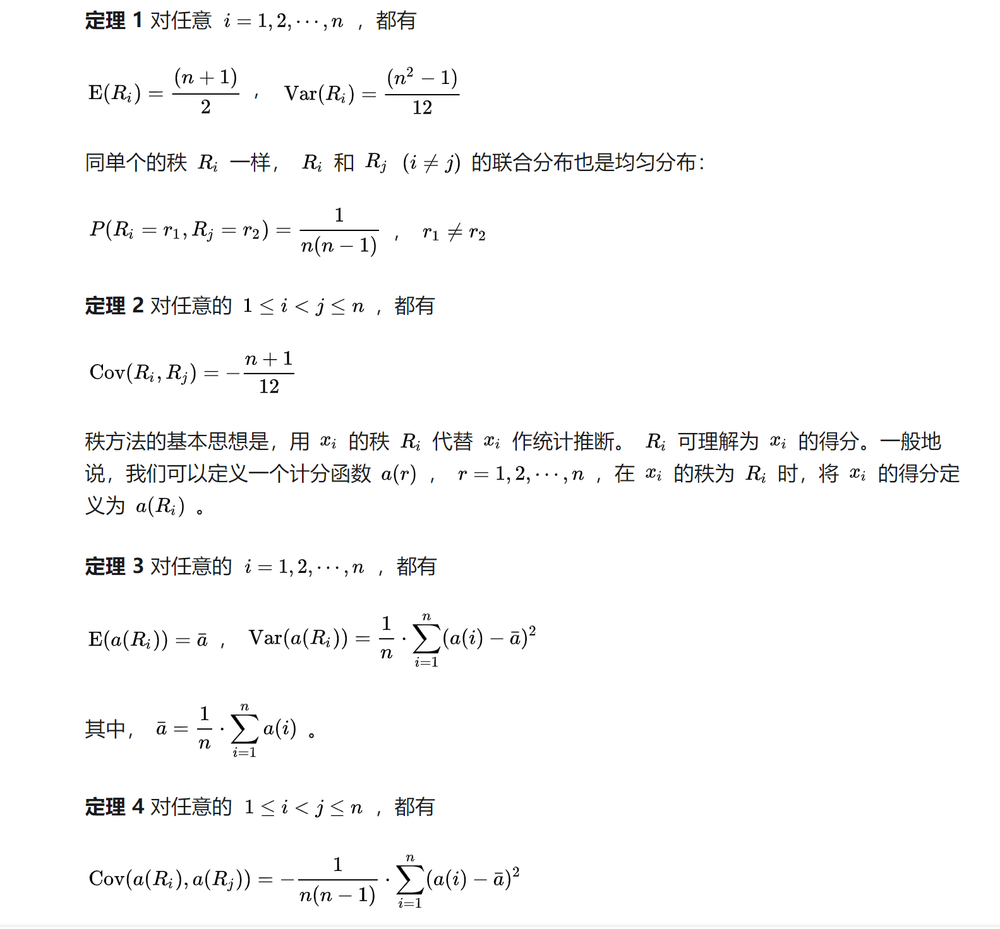

## 概率论

#### 排列组合

**n 个物品中，按顺序的选择 k 个物品**
$$
A_8^3=\dfrac{8!}{(8-3)!}=8\times 7\times 6
$$
**n 个物品中，选择 k 个物品出来，选择的顺序无所谓**
$$
C_8^3=\dfrac{8!}{(8-3)!\times 3!}
$$

#### 常见分布

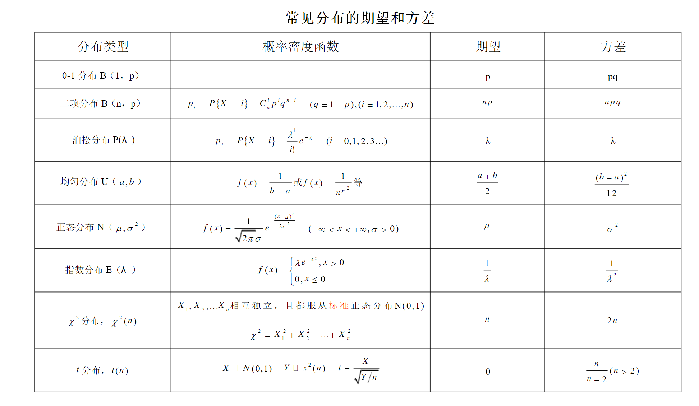

#### 条件概率

$$
P(A|B)=\dfrac{P(A,B)}{P(B)}
$$

#### 贝叶斯公式

$$
P(A | B)=\frac{P(B | A) P(A)}{P(B)}
$$

#### 全概率公式

$$
P(A)=\sum_{i=1}^{n} P\left(A | B_{i}\right) P\left(B_{i}\right)
$$

#### 边缘概率

## 数据库

