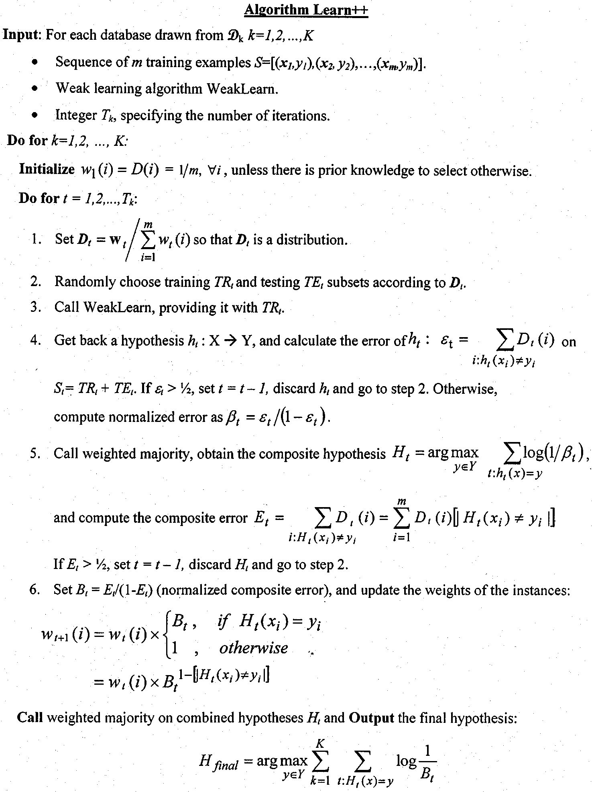

## Decouple

### [A Robust Static Decoupling Algorithm for 3-Axis Force Sensors Based on Coupling Error Model and $\epsilon$-SVR](.\reference\sensors-12-14537.pdf)

> Instead of regarding the whole system as a black box in conventional algorithm, the coupling error model is designed by the principle of coupling errors, in which the nonlinear relationships between forces and coupling errors in each dimension are calculated separately. Six separate **Support Vector Regressions (SVRs)** are employed for their ability to perform adaptive, nonlinear data fitting. 

#### Linear  Static Decoupling

1.  **Least Square Method (LSM)**: This algorithm is based on the assumption that relationships between input forces and output voltages in all dimensions are linear.
2. **Shape from motion**: which the motion of the force vector and the calibration matrix are simultaneously extracted by singular value decomposition from raw sensor signals. 
3. **NN for linear static decouple**:  to increase the accuracy of decoupling.

#### Nonlinear Static Decoupling

1.  **NN with back propagation (BP)**: to realize the nonlinear Multiple Input Multiple Output (MIMO) mapping of a multi-axis force sensor.
2. **Radial basis function (RBF) NN** : Engineering applications show that decoupling algorithms with a standard NN model can sometimes reduce coupling error significantly , but sometimes generate worse results than without decoupling due to overfitting. [径向基函数神经网络在多维力传感器标定中的应用](./reference/径向基函数神经网络在多维力传感器标定中的应用_俞阿龙.pdf)
3. **Support Vector Machine (SVM)**:  SVM starts from solving problems of classification. With the introduction of Vapnik’s $\epsilon$ -insensitive loss function, it also extends to be a regression prediction tool that uses machine learning theory to maximize predictive accuracy while not subject to local minimal and overfitting.
4. **Support Vector Regression(SVR)**: The proposed coupling error model consists of six SVRs and three linear fitting functions, which is more conformable to calibration data structure. 

### [Decoupling Strategy of Multi-dimensional Force Sensor Based on LS-SVM and $\alpha$th-order Inverse System Method](.\reference\untitled.pdf)

1. 最小二乘支持向量机
2. As one kind of Support Vector Machine, LS-SVM algorithm’s loss function is quadratic term of error.

## Incremental Learning

### Paper

1. Kuncheva提出了对增量学习的普遍接受的定义([Learn++: An incremental learning algorithm for supervised neural networks](./reference/10.1.1.16.1297.pdf))

   - 可以学习新的信息中的有用信息

   - 不需要访问已经用于训练分类器的原始数据

   - 对已经学习的知识具有记忆功能(避免灾难性遗忘)

   - 在面对新数据中包含的新类别时，可以有效地进行处理

     

2. 将增量学习应用到不同领域

   - [Incremental learning for robust visual tracking](./reference/Incremental_learning_for_robust_visual_t.pdf)
   - [Incremental learning with support vector machines](./reference/10.1.1.95.8001.pdf)

### [Parameter Incremental Learning Algorithm for Neural Networks](./reference/04012047.pdf)

- First, the adaptation
- Second, the preservation of a priori results

1. For a given input–output pair of training data, the weighted squared error between the target value and the predicted output by the neural network is chosen to measure the performance of adap- tation, expressed as
$$
J_{adpt}=\dfrac{1}{2}\Delta y_{new}^TD\Delta y_{new}
$$
​     	where $D$ is a positive-define weight matrix, and
$$
\Delta y_{new}=\Psi (x, \theta+\delta\theta)-y
$$
​	This is the prediction error of the neural network after the parameter is updated from $\theta$ to $\theta + \delta \theta$

2. The performance index measuring the neural network’s deformation caused by the parameter adaptation is chosen to be the commonly used squared $L_2$-norm induced metric of the distance between functions

$$
J_{pres}=\dfrac{1}{2}m_{L_2}^2(\Psi(x, \theta+\delta\theta),\Psi(x,\theta))
$$

​	where 
$$
m_{L_2}^2(\Psi(x, \theta+\delta\theta),\Psi(x,\theta))=(\int_{x\in F} \|\Psi(x,\theta+\delta\theta)-\Psi(x,\theta)\|^2dx)^{1/2}
$$

​	$F$ is a properly defined region of the input to the network 

3. Ideally, we want both $J_{adpt}$  and $J_{pres}$ be as small as possible after the parameter update. Thus, the cost function can be written into a single cost function as follow:
   $$
   J=J_{adpt}+J_{pres}
   $$

4. However, it is extremely difficult to find such a solution (or an approximate solution) to this problem for general neural networks with nonlinear neurons. To overcome this situation, the preservation performance should be measured at the neuron level, instead of at the global level. The performance index is measured against the deformation of **the individual neurons** instead of against the entire neural network as a whole. 

$$
\tilde{J}_{pres}=\dfrac{1}{2}\lambda_i m_{L_2}^2(g_i(u_i,\theta_i+\delta\theta_i),g_i(u_i,\theta_i))
$$

   where the distance metric 
$$
m_{L_2}^2(g_i(u_i,\theta_i+\delta\theta_i),g_i(u_i,\theta_i))=( \int_{u_i\in F_i}g_i(u_i,\theta_i+\delta\theta_i)-g_i(u_i,\theta_i)du_i)^{\frac{1}{2}}
$$
$\lambda_i$ is are positive numbers. $u_I$ is the input to the $i$th neuron $g_i$

5. **Theorem 1 (General PIL Algorithm):** The first-order approximate solution to the general PIL problem is given by where
   $$
   \delta \theta_i^{PIL}\triangleq -\dfrac{1}{\lambda_i} 
   $$
   